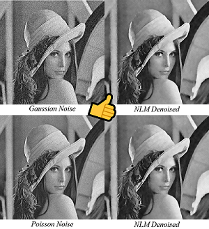

# nlm-cuda

This repository implements [Non-Local Means Denoising Method](https://ieeexplore.ieee.org/document/1467423/) on both CPU and CUDA to accelerate.

<p align="center">
    </img>    
</p>

## FYI

- Not recommended for production use.
- Integral image optimization strategy is not implemented here.
- Only gray scale (single channel) image is supported now.

## Build

CMake is used to generate. RapidJSON is one of dependencies. CUDA is needed for GPU version.

- Check CMakeLists.txt in root directory. Set `RapidJSON_DIR` according to where your RapidJSON library is.

- Maybe you should modify CUDA BlockThread according to the Compute Capability of your NVIDIA GPU to achieve best concurrency.

  ```diff
  - dim3 BlockThread(16, 16); // use 16x16 threads concurrent
  + dim3 BlockThread(what, you); // want
  ```

- Generate with CMake. And then compile to your platform.

## Usage

- A config file is needed. Refer to [NLMConfig.json](./NLMConfig.json) for a sample.
- Call

  ```sh
  path/to/nlm-cuda config.json
  ```

## Document

[（212138-卓旭）《数字图像处理进展》课程报告.pdf](./doc/（212138-卓旭）《数字图像处理进展》课程报告.pdf)

## License

MIT

